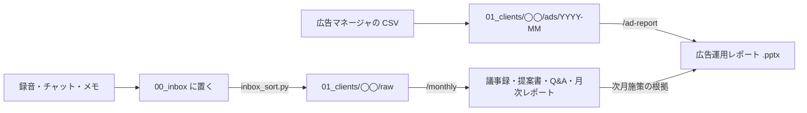

# consulting-report — コンサル業務記録＆広告レポート自動生成ツール

メタ広告（Facebook / Instagram 広告）の運用コンサル業務のためのツールです。
会議の録音・チャット・メモなど「実際にやった仕事の記録」と、広告マネージャから書き出した広告データをもとに、
**議事録・提案書・Q&A・稼働ログ・月次レポート**と、**広告運用レポート（PowerPoint 60〜90枚）**を自動で下書きします。

> **大原則：記録（ソース）に遡れないことは書かない。**
> 書けない所は「要確認」のまま残します。広告レポートの数字はすべてプログラムが計算し、AI は数字を1つも書きません。

---

## できること

| 入れるもの | 出てくるもの | 使うコマンド |
|---|---|---|
| 会議の文字起こし（`.md` / `.txt`）、Slack のエクスポート、一行メモ | クライアント別に仕分けた記録（`raw/`） | `python3 03_scripts/inbox_sort.py` |
| 仕分けた記録 | 稼働ログ・議事録・提案書・Q&A・月次レポート（Markdown） | Claude Code で `/monthly` |
| 広告マネージャの CSV（広告×日別、年齢性別・配置・デバイス・地域の内訳） | 広告運用レポート（`.pptx`、PowerPoint で編集できるグラフ付き） | Claude Code で `/ad-report <クライアント名>` |

### 流れ



人がやるのは「記録を置く」「週1でエクスポートを入れる」「月初にレビューして送る」の3つだけです。

---

## はじめかた

### 1. 必要なもの
- **Mac**（Windows でも Python は動きますが、動作確認は Mac のみ）
- **Python 3.9 以上**（パイソン。自動処理のプログラムを動かす言語）… ターミナルで `python3 --version` と打って確認
- **Claude Code**（クロード・コード。フォルダの中のファイルを読み書きできる AI）… 議事録やレポートの文章を書く担当
- **Obsidian**（オブシディアン。Markdown ファイルをノートとして見るアプリ）… 任意。記録や生成物を読みやすく見るため
- **PowerPoint** または Keynote … 生成したレポートを開いて確認するため

### 2. 取り込む
```bash
git clone https://github.com/Icchaso/consulting-report.git
cd consulting-report/consulting-vault
```

### 3. 広告レポート用の部品を入れる（最初の1回だけ）
PowerPoint を作る部分だけ、追加の部品（python-pptx）が必要です。それ以外は Python に最初から入っている機能だけで動きます。
```bash
pip3 install -r 03_scripts/ad_report/requirements.txt
```

### 4. サンプルで動かしてみる
架空のクライアント「サンプル商事」「テスト工務店」のデータが最初から入っています。
```bash
claude                                  # consulting-vault の中で Claude Code を起動
```
起動後に次のように打ちます（初回は「このフォルダを信頼しますか」と聞かれるので許可する）。
```
/monthly 2026-09                        # 議事録・月次レポートを作り直す
/ad-report サンプル商事 2026-09          # 広告運用レポート（PowerPoint）を作り直す
```
できあがったレポートは `01_clients/サンプル商事/2026-09/ads/` にあります。

日々の使い方（ファイル名の付け方、毎月の流れ、クライアントの追加）は **[consulting-vault/README.md](consulting-vault/README.md)** を見てください。

---

## 広告レポートのデータの出し方

広告マネージャから CSV で書き出し、`01_clients/<クライアント名>/ads/<YYYY-MM>/` に置きます。前月比を出すなら前月分も同じ形で置きます。

| ファイル | 書き出し方 | 必須 |
|---|---|---|
| 広告×日別 | レベル＝広告、内訳＝日（期間の分割＝1日） | ◎ |
| キャンペーンの期間合計 | レベル＝キャンペーン、内訳なし（正しいリーチを出すため） | 推奨 |
| 年齢×性別 / 配置 / デバイス / 地域 | それぞれ内訳を付けて1ファイルずつ | 任意 |

- 列名は日本語・英語どちらの画面で書き出しても読めるようにしてあります（`03_scripts/ad_report/column_map.json`）。読めない列があれば警告が出ます
- 目標対比のページを出すには、クライアントの `_profile.md` の設定欄に `ad_kpi_targets: [cpa=4500, roas=1.5, ctr=1.0]` のように書きます
- レポートの構成（ページの ON/OFF、並び、フォント、色）は `03_scripts/ad_report/deck_config.json` で変えられます

---

## データの扱い（大事）

- **このリポジトリに入っているのは「ツール本体」と「架空のサンプル2社」だけです。**
- 実際のクライアントの記録は、`.gitignore`（Git に含めないファイルの一覧）で自動的に除外されます
  - `01_clients/` の中の新しいクライアントのフォルダ（サンプル2社以外）
  - `00_inbox/` の中身、`04_logs/` の中身、`.env`
- コミットの前には `git status` で、クライアントのファイルが入っていないか確認してください
- vault を iCloud Drive や Dropbox の中に置かないでください（クライアントの機密がネット上に自動で複製されるため）

---

## フォルダ構成

```
consulting-report/
├── README.md                     ← このファイル（全体の説明）
├── HANDOFF.md                    ← 開発の現状と次にやること
├── コンサル業務記録ツール_設計書/   ← 設計書（図解PDF・詳細版）
├── 開発メモ/データ契約.md          ← スクリプト同士の約束（ファイル名・データの形）
└── consulting-vault/             ← ツール本体（Obsidian の vault として開く）
    ├── CLAUDE.md                 ← AI へのルール（書いてよいこと・禁止事項）
    ├── README.md                 ← 利用者向けの使い方
    ├── 00_inbox/                 ← 記録の入口
    ├── 01_clients/<クライアント>/  ← _profile.md・raw/（記録）・ads/（広告CSV）・YYYY-MM/（生成物）
    ├── 02_templates/             ← 議事録・提案書などのひな形
    ├── 03_scripts/               ← 仕分け・集計・検査のプログラム（ad_report/ が広告レポート）
    ├── 04_logs/                  ← 処理の記録
    ├── 99_samples/               ← 動作確認用のダミーデータ
    └── .claude/commands/         ← /monthly /ad-report /daily-check の手順書
```

---

## 開発する人へ

### ルール
- `raw/`・`ads/`（元の記録）と `sent/`（送った事実）は、プログラムからも AI からも書き換えない
- 記録系のスクリプトは **Python 標準ライブラリだけ・Python 3.9 で動くこと**。例外は PowerPoint を作る `build_deck.py`（python-pptx）だけ
- ファイル名やデータの形を変えるときは、[開発メモ/データ契約.md](開発メモ/データ契約.md) と関係するスクリプト・テンプレートを同時に直す
- 個人のパス（`/Users/名前/…`）や個人の環境に依存する書き方をしない

### テスト
```bash
cd consulting-vault
python3 -m unittest discover -s 03_scripts/tests              # 記録系（56件）
python3 -m unittest discover -s 03_scripts/ad_report/tests    # 広告レポート（26件。python-pptx が必要）
```

### 現状と今後
進み具合と次にやることは [HANDOFF.md](HANDOFF.md) にまとめています。主な予定:
- 実際のレポートの構成・デザイン、会社テンプレートに合わせる
- 広告マネージャの実データで列名を確定する
- PowerPoint の実機での見た目を確認する
- LINE・Gmail の取り込み、定時実行、Meta の API（プログラムから広告データを直接取る仕組み）との連携（運用が回ってから）
